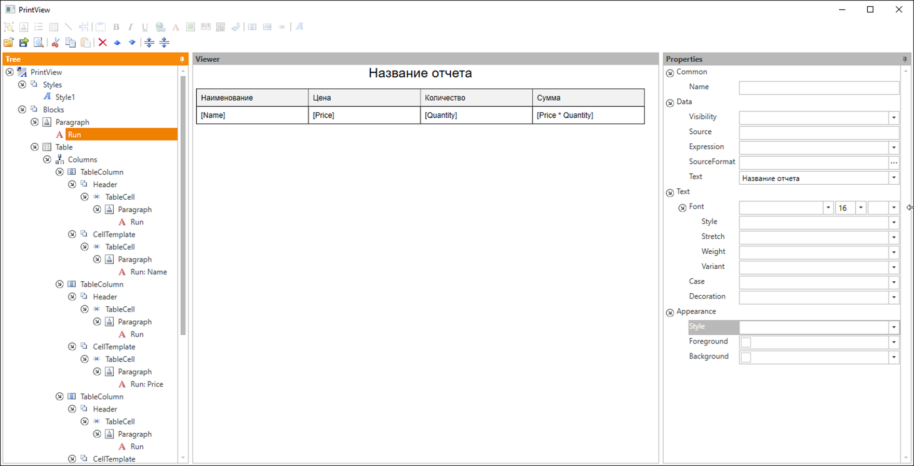

# InfinniPlatform.PrintViewDesigner

PrintViewDesigner is WYSIWYG editor for printed forms of [InfinniPlatform](https://github.com/InfinniPlatform/InfinniPlatform).



# NuGet Source

http://nuget.infinnity.ru/packages/InfinniPlatform.PrintViewDesigner/

# Installation

```bash
set VERSION=1.0.0.5-master
nuget install "InfinniPlatform.PrintViewDesigner" -Version %VERSION% -OutputDirectory "packages" -NonInteractive -Prerelease -Source "http://nuget.org/api/v2;http://nuget.infinnity.ru/api/v2"
powershell -NoProfile -ExecutionPolicy Bypass -Command ".\packages\Infinni.Node.%VERSION%\lib\net45\Install.ps1"
rd /s /q packages
cd InfinniPlatform.PrintViewDesigner.%VERSION%
```
